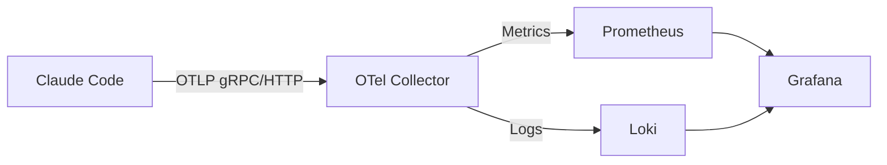

# GEMINI.md

This file provides context and guidance for Gemini agents working with the `claude-code-otel` repository.

## Project Overview

`claude-code-otel` is a comprehensive observability solution for monitoring Claude Code usage, performance, and costs. It implements an OpenTelemetry-based monitoring stack:

1.  **Claude Code** (Source): Generates telemetry data.
2.  **OpenTelemetry Collector**: Ingests, processes, and exports data.
3.  **Prometheus**: Stores metrics (time-series).
4.  **Loki**: Stores logs and events.
5.  **Grafana**: Visualizes data via dashboards.

## Common Commands

Use `make` for most operations.

### Stack Management

- `make up`: Start all services (Grafana :3000, Prometheus :9090, Loki :3100, OTel Collector :4317/:4318).
- `make down`: Stop all services.
- `make restart`: Restart all services.
- `make status`: Show service status and URLs.
- `make clean`: Clean up containers and volumes.

### Development & Debugging

- `make logs`: View all logs.
- `make logs-collector`: View OTel collector logs only.
- `make validate-config`: Validate `docker-compose.yml` and `collector-config.yaml`.
- `make setup-claude`: Show environment variables needed to enable Claude Code telemetry.

## Architecture & Data Flow

### Key Components

- **OTel Collector** (`collector-config.yaml`): The central processing unit. It receives data on ports 4317 (gRPC) and 4318 (HTTP).
- **Prometheus** (`prometheus.yml`): Scrapes the collector's Prometheus exporter.
- **Grafana** (`claude-code-dashboard.json`): The UI. Dashboards are provisioned from JSON.

## Key Files

- `docker-compose.yml`: Defines the services.
- `collector-config.yaml`: Configuration for the OpenTelemetry Collector (receivers, processors, exporters).
- `prometheus.yml`: Configuration for Prometheus scraping.
- `claude-code-dashboard.json`: The Grafana dashboard definition.
- `Makefile`: Task runner for the project.
- `.trunk/trunk.yaml`: Configuration for Trunk (linters, formatters).

## Development Guidelines

1.  **Configuration Validation**: Always run `make validate-config` after modifying `collector-config.yaml` or `docker-compose.yml`.
2.  **Dashboard Edits**: The dashboard is defined in `claude-code-dashboard.json`. If you need to modify it, ensure the JSON is valid.
3.  **Linting**: This project uses Trunk. Ensure changes pass linting checks.
